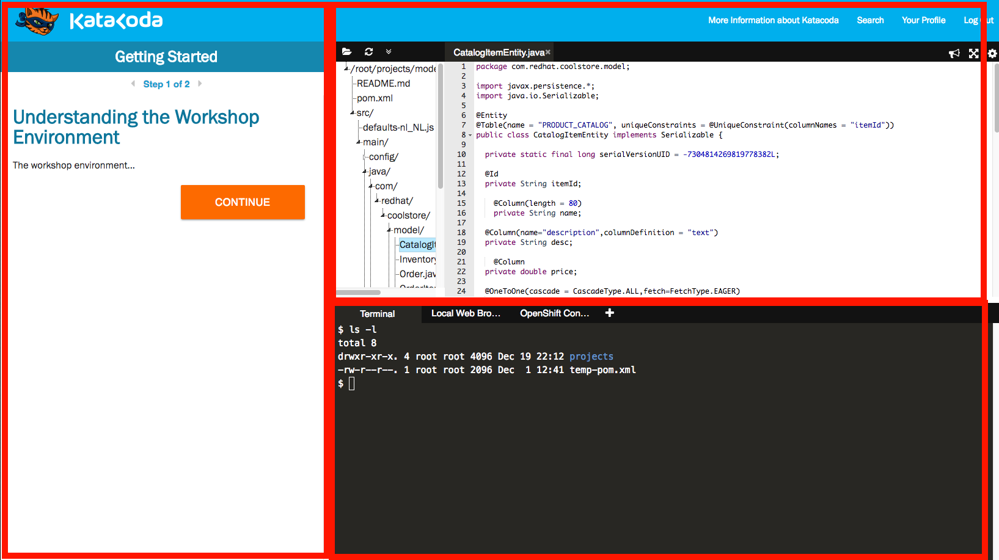

This workshop is split into several _scenarios_, each of which focuses on a specific
area related to Application Modernization and Transformation with Red Hat technologies.

> Note that if you close your browser tab in which you are working, you'll lose your progress
in the current scenario and have to start over from the beginning of the scenario.

Each scenario in turn has a number of steps that you follow to complete the scenario in the
order shown on the front page.

If you get stuck, you can always freely move between the steps with the left and right
arrows at the top of the instructions in case you missed a step, or start the entire scenario
from the beginning by simply reloading your browser's page.

As you complete each step within a scenario, click the **Continue** button to move on to the next
step.