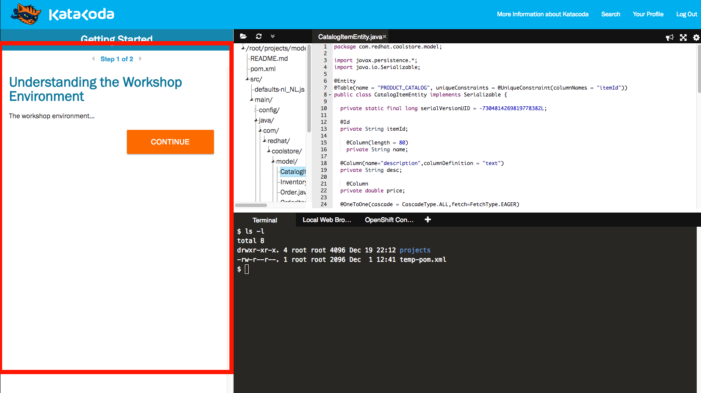

In the instructions pane on the left (where you're reading this text) are the instructions for each step of each scenario.
Follow the instructions to complete the scenario.

## Executing Commands

Occasionally you'll see an executable command such as:

``echo "Hello World!"``{{execute}}

You can manually type this command into the terminal on the right, or you can
click the command itself to automatically copy and paste and execute
the command in the terminal (which is a fully functional Linux terminal!)

## Links

Links are [highlighted](http://redhat.com) and can be clicked to open
a separate tab in your browser.

## Opening files

You may also encounter instructions that ask you to open a file in the
editor, and be provided a link such as this one: `hello.txt`{{open}}. Clicking
on the filename will open the file's content into the editor at the upper right,
and you can edit the file right away.

## Editing code

The code editor at the upper right is a fully functional text-based
editor for editing code. You can edit the code directly in the window and your
changes will automatically be saved. Occasionally you may encounter code
snippets with a **Copy to Editor** link, such as:

<pre class="file" data-filename="hello.txt" data-target="replace">
This is code that I can copy and paste without having to type it in!
</pre>

These snippets save you time by writing code for you, but you're always encouraged
to try and type the code in yourself where it makes sense and doesn't take too much
time.
