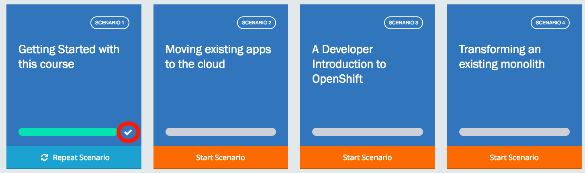

You are now ready to start on your first scenario and learn about transforming applications using Red Hat Developer technologies.
If you have any questions, be sure to ask any of the workshop teachers!

As you progress through the scenarios, your progress is tracked:

Click **More Scenarios** below to complete this scenario and move on to the next, and don't forget to have fun!