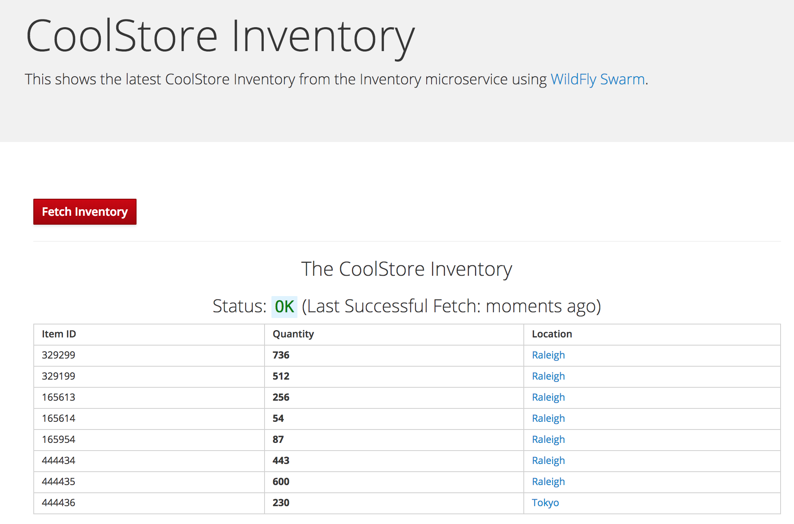

The sample project shows the components of a basic WildFly Swarm project laid out in different
subdirectories according to Maven best practices.

**1. Run the following command to examine the Maven project structure.**

> Click on the `tree` command below to automatically copy it into the terminal and execute it

``tree``{{execute}}

This is a minimal Java EE project which implements a RESTful microservice which implements the _inventory_ service
from the CoolStore monolith. Click the links below to open each file and inspect its contents:

* `pom.xml`{{open}} - Maven project file describing how to build the project
* `src/main/java/com/redhat/coolstore/model/Inventory`{{open}} -  POJO declaring the Inventory entity type
* `src/main/java/com/redhat/coolstore/service/InventoryService`{{open}} - Stateless service to access the Inventory database
* `src/main/java/com/redhat/coolstore/rest/RestApplication.java`{{open}} - Declares the RESTful resource base path (`/services`)
* `src/main/java/com/redhat/coolstore/rest/InventoryEndpoint.java`{{open}} - Declares RESTful endpoints of `/services/inventory` and `/services/inventory/{itemId}`

Review the content a bit and notice that there are some comments in the code. Do not remove them! The comments are used as marker and without them you will not be able finish the scenario.

The `/services/inventory` API returns a list of products and their available inventory counts, as well as a link to the local
store which carries the inventory.

The `/services/inventory/{itemId}` API returns the inventory for a single product based on `itemId`.

**2. Compile and run the application**

Before we add code to the project you should build and test that current application starts as it should. 

Since this is already a working application you can already without any code changes run the application locally directly from `maven` using `wildfly-swarm:run` as the goal

`mvn wildfly-swarm:run`{{execute}}

Since this is the first time we run maven may have to pull down some dependencies (we have tried to prepopulate most for you), but subsequent runs should go really fast.

Once the application is done initializing you should see:

```console
INFO  [org.wildfly.swarm] (main) WFSWARM99999: WildFly Swarm is Ready
```

Running locally using `wildfly-swarm:run` will use an in-memory database with default credentials. In a production application you
will use an external source for credentials using an OpenShift _secret_ in later steps, but for now this will work for development and
testing.

**3. Test the application**

To test the running application, click on the **Local Web Browser** tab in the console frame of this browser window. This will open another tab or window of your browser pointing to port 8080 on your client.


> or use [this](https://[[HOST_SUBDOMAIN]]-8080-[[KATACODA_HOST]].environments.katacoda.com/) link.

You should now see a html page that looks like this



This is a simple webpage that will access the inventory *every 2 seconds* and refresh the table of product inventories.

You can also click the **Fetch Inventory** button to force it to refresh at any time.

**4. Stop the application**

Before moving on, click in the terminal window and then press CTRL-C to stop the running application!

You should see this:

```console
WFLYSRV0028: Stopped deployment inventory-1.0.0-SNAPSHOT.war (runtime-name: inventory-1.0.0-SNAPSHOT.war) in 70ms
```

This indicates the application is stopped.

## Congratulations

You have now successfully executed the first step in this scenario. 

Now you've seen how you with a few lines of code one can create a simple RESTful HTTP Server capable of serving content using WildFly Swarm.

This will be the basis for our new inventory microservice.

In next steps of this scenario we will deploy our application to OpenShift Container Platform and then start
adding additional features to take care of various aspects of cloud native microservice development.
