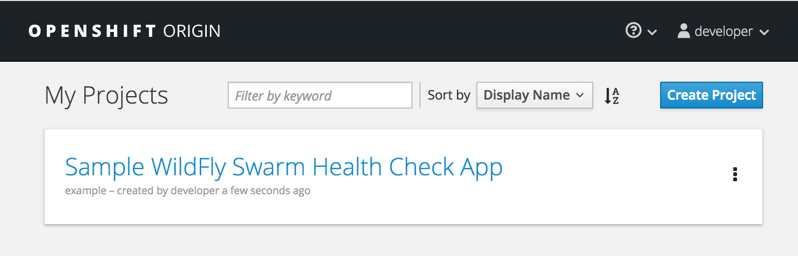

**Red Hat OpenShift Container Platform** is the preferred runtime for cloud native application development
using **Red Hat OpenShift Application Runtimes**
like **WildFly Swarm**. OpenShift Container Platform is based on **Kubernetes** which is the most used Orchestration
for containers running in production. **OpenShift** is currently the only container platform based on Kubernetes
that offers multi-tenancy. This means that developers can have their own personal isolated projects to test and
verify applications before committing them to a shared code repository.

We have already deployed our coolstore monolith to OpenShift, but now we are working on re-architecting it to be
microservices-based, so let's create a separate project to house it and keep it separate from our monolith.

**1. Create project**

For this scenario, let's create a project that you will use for your new microservices.

```oc new-project coolstore-microservice --display-name="CoolStore Microservice Application"```{{execute}}

**3. Open the OpenShift Web Console**

OpenShift ships with a web-based console that will allow users to
perform various tasks via a browser. To get a feel for how the web console
works, click on the "OpenShift Console" tab next to the "Local Web Browser" tab.


The first screen you will see is the authentication screen. Enter your username and password and 
then log in:


* Username: `developer`
* Password: `developer`

After you have authenticated to the web console, you will be presented with a
list of projects that your user has permission to work with.



Click on the `CoolStore Microservice Application` to be taken to the project overview page
which will list all of the routes, services, deployments, and pods that you have
running as part of your project:


There's nothing there now, but that's about to change.

