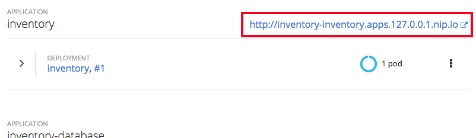

Now that you've logged into OpenShift, let's deploy our new inventory microservice:

**1. Deploy the Database**

Our production catalog microservice will use an external database (PostgreSQL) to house inventory data.
First, deploy a new instance of PostgreSQL by executing:

`oc new-app -e POSTGRESQL_USER=catalog \
             -e POSTGRESQL_PASSWORD=mysecretpassword \
             -e POSTGRESQL_DATABASE=catalog \
             openshift/postgresql:latest \
             --name=catalog-database`{{execute}}

> **NOTE:** If you change the username and password you also need to update `src/main/fabric8/credential-secret.yml`{{open}} which contains
the credentials used when deploying to OpenShift.

This will deploy the database to our new project. Wait for it to complete:

`oc rollout status dc/catalog-database`{{execute}}

**2. Build and Deploy**

Red Hat OpenShift Application Runtimes includes a powerful maven plugin that can take an
existing Spring Boot application and generate the necessary Kubernetes configuration.
You can also add additional config, like ``src/main/fabric8/catalog-deployment.yml``{{open}} which defines
the deployment characteristics of the app (in this case we declare a few environment variables which map our credentials
stored in the secrets file to the application), but OpenShift supports a wide range of [Deployment configuration options](https://docs.openshift.org/latest/architecture/core_concepts/deployments.html) for apps).

Build and deploy the project using the following command, which will use the maven plugin to deploy:

`mvn package fabric8:deploy -Popenshift`{{execute}}

The build and deploy may take a minute or two. Wait for it to complete. You should see a **BUILD SUCCESS** at the
end of the build output.

After the maven build finishes it will take less than a minute for the application to become available.
To verify that everything is started, run the following command and wait for it complete successfully:

`oc rollout status dc/catalog`{{execute}}

>**NOTE:** If you recall in the WildFly Swarm lab we created a health check manually, for Spring Boot the fabric8 maven plugin will automatically detect that if we have `spring-boot-starter-actuator` on our classpath and then automatically create these health checks for us.

**3. Access the application running on OpenShift**

This sample project includes a simple UI that allows you to access the Inventory API. This is the same
UI that you previously accessed outside of OpenShift which shows the CoolStore inventory. Click on the
[route URL](http://catalog-catalog.[[HOST_SUBDOMAIN]]-80-[[KATACODA_HOST]].environments.katacoda.com)
to access the sample UI.

> You can also access the application through the link on the OpenShift Web Console Overview page. 

The UI will refresh the catalog table every 2 seconds, as before.

>**NOTE:** Since we previously have a inventory service running you should now see the actual quantity value and not the fallback value of -1 

Click on the below link to access the Deployment details page to see details on the currently deployed application:

* [Catalog Deployment Details](http://[[HOST_SUBDOMAIN]]-8443-[[KATACODA_HOST]].environments.katacoda.com/console/projects/catalog/browse/rc/catalog-1?tab=details)

