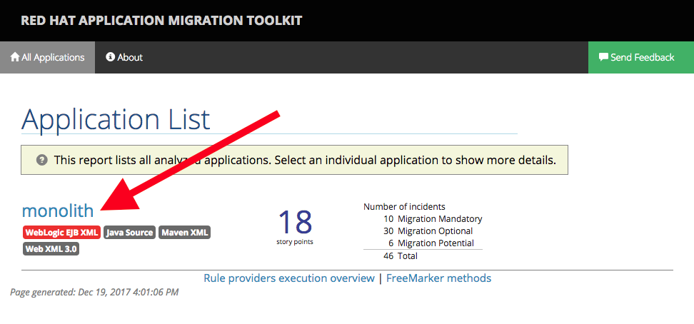

In this step we will analyze an existing application built for use with
Oracle® WebLogic Server (WLS). This application is a Java EE application
using a number of different technologies, including standard Java EE APIs
as well as proprietary Weblogic APIs and best practices.

The Red Hat Application Migration Toolkit can be installed and used in a few different ways:

* **Web Console** - The web console for Red Hat Application Migration Toolkit is a web-based system that allows a team of users to assess and prioritize migration and modernization efforts for a large number of applications. It allows you to group applications into projects for analysis and provides numerous reports that highlight the results.
* **Command Line Interface** - The CLI is a command-line tool that allows users to assess and prioritize migration and modernization efforts for applications. It provides numerous reports that highlight the analysis results.
* **Eclipse Plugin** - The Eclipse plugin for Red Hat Application Migration Toolkit provides assistance directly in Eclipse and Red Hat JBoss Developer Studio for developers making changes for a migration or modernization effort. It analyzes your projects using RHAMT, marks migration issues in the source code, provides guidance to fix the issues, and offers automatic code replacement when possible.

For this scenario, we will use the CLI as you are the only one that will run RHAMT in this system. For multi-user use, the Web Console would be a good option.

**1. Unzip the Red Hat Application Migration Toolkit CLI**

Installing the CLI is the first step. The CLI is distributed as a downloadable archive that can be installed
using the following command:

```unzip -d ${HOME} /some/path/to/rhamt-cli.zip```{{execute}}

To verify that the tool was properly installed, run:

`${HOME}/rhamt-cli-4.0.0.Beta4/bin/rhamt-cli`{{execute}}

You should see:

```
Using RHAMT at /root/rhamt-cli-4.0.0.Beta4
> Red Hat Application Migration Toolkit (RHAMT) CLI, version 4.0.0.Beta4.
```

**2. Run the RHAMT CLI against the project**

The RHAMT CLI has a number of options to control how it runs. Click on the below command
to execute the RHAMT CLI and analyze the existing project:

```
~/rhamt-cli-4.0.0.Beta4/bin/rhamt-cli \
  --sourceMode \
  --input ~/projects/modernize-apps-labs/monolith \
  --output ~/rhamt-report \
  --overwrite \
  --source weblogic \
  --target eap:7
```{{execute}}

> Note the use of the ``--source`` and ``--target`` options. This allows you to target specific migration paths supported by RHMAT. Other
migration paths include **IBM® WebSphere® Application Server** and **JBoss EAP** 5/6/7.

**3. View the results**

The RHAMT CLI generates an HTML report. To view the report, first startup a simple web server:

```docker run -v ~/rhamt-report:/usr/share/nginx/html:ro -p 9000:80 -it nginx```{{execute}}

Then [click to view the report](https://[[HOST_SUBDOMAIN]]-9000-[[KATACODA_HOST]].environments.katacoda.com/)

You should see the landing page for the report:



## Understanding the report

The main landing page of the report lists the applications that were processed. Each row contains a high-level overview of the story points, number of incidents, and technologies encountered in that application.

In this case, as we used the `monolith` directory, click in `monolith` to access the report for this application.


This will show the Dashboard overview, which gives an overview of the entire application migration effort. It summarizes:

* The incidents and story points by category
* The incidents and story points by level of effort of the suggested changes
* The incidents by package

> Story points are an abstract metric commonly used in Agile software development to estimate the relative level of effort needed to implement a feature or change.
Red Hat Application Migration Toolkit uses story points to express the level of effort needed to migrate particular application constructs, and the application as a whole.

There are several other sub-pages accessible by the menu near the top. Cick on each one and observe the results for each of these pages:

* **Issues** Provides a concise summary of all issues that require attention.
* **Application Details** provides a detailed overview of all resources found within the application that may need attention during the migration.
* **Unparsable** shows all files that RHAMT could not parse in the expected format. For instance, a file with a .xml or .wsdl suffix is assumed to be an XML file. If the XML parser fails, the issue is reported here and also where the individual file is listed.
* **Dependencies** displays all Java-packaged dependencies found within the application.
* **Remote Services** Displays all remote services references that were found within the application.
* **EJBs** vontains a list of EJBs found within the application.
* **JBPM** vontains all of the JBPM-related resources that were discovered during analysis.
* **JPA** vontains details on all JPA-related resources that were found in the application.
* **Hibernate** vontains details on all Hibernate-related resources that were found in the application.
* **Server Resources** Displays all server resources (for example, JNDI resources) in the input application.
* **Spring Beans** Contains a list of Spring beans found during the analysis.
* **Hard-coded IP Addresses** Provides a list of all hard-coded IP addresses that were found in the application.
* **Ignored Files** Lists the files found in the application that, based on certain rules and RHAMT configuration, were not processed. See the --userIgnorePath option for more information.
* **About** Describes the current version of RHAMT and provides helpful links for further assistance.

> Some of the above sections may not appear depending on what was detected in the project.

Now that you have the RHAMT report available, let's get to work migrating the app!