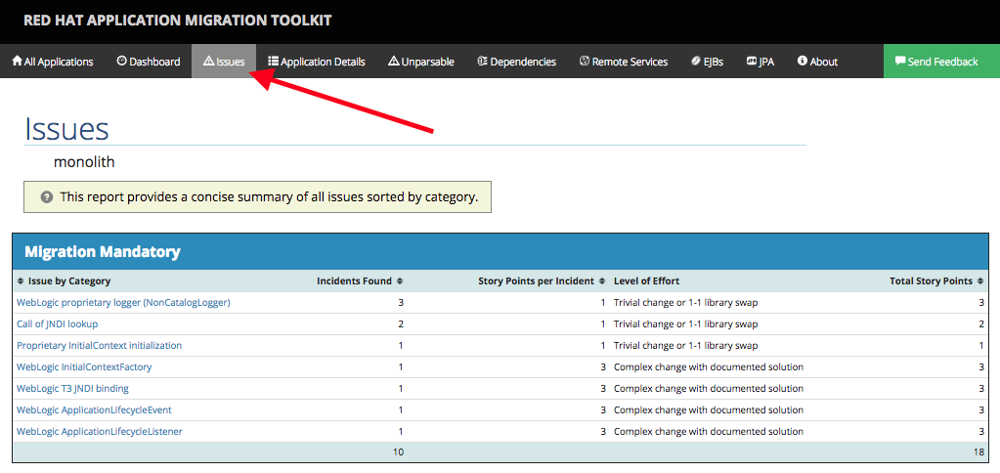

In this step we will migrate some Weblogic-specific code in the app to use standard Java EE interfaces.

The first issue we will tackle is the one reporting the use of _Weblogic ApplicationLifecyleEvent_ and
_Weblogic LifecycleListener_.  The WebLogic `ApplicationLifecycleListener` abstract class is used to perform functions or schedule jobs at Oracle WebLogic Server start and stop. In this case we have
code in the `postStart` and `preStop` methods which are executed after Weblogic starts up and before it shuts down, respectively.

In JBoss Enterprise Application Platform, there is no equivalent to intercept these events, but you can get equivelant functionality using a _Singleton EJB_ with standard annotations.
We will use the `@Startup` annotation to tell the container to initialize the singleton session
bean at application start. We will similarly use the @PostConstruct and `@PreDestroy` annotations to specify the
methods to invoke at the start and end of the application lifecyle achieving the same result but without
using proprietary interfaces.

**1. Select the issue related to `ApplicationLifecycleListener`**

[Open the report](https://[[HOST_SUBDOMAIN]]-9000-[[KATACODA_HOST]].environments.katacoda.com/) and then
click on monolith and navigate to the **Issues** tab:



RHAMT provides helpful links to understand the issue deeper and offer guidance for the migration.

**2. Open the file**

Click here to open the offending file `src/main/java/com/redhat/coolstore/utils/StartupListener.java`{{open}}

**2. Remove weblogic-specific `import` statements and inheritance**

The first step is to remove all instances of `import weblogic.x.y.z` at the top of the file. This ensures that our code will
not compile or run until we complete the migration. Remove the import statements for `weblogic.application.ApplicationLifecycleEvent` and
`weblogic.application.ApplicationLifecycleListener`.

Next, remove the inherited class by removing `extends ApplicationLifecycleListener` from the class definition. We no longer need it.

Finally change the method signatures for the `postStart` and `preStop` methods to remove the weblogic arguments and the `@Override`
annotations since our methods no longer override the Weblogic-specific super class.

```
public void postStart() { ... }
public void preStop() { ... }
```


**3. Annotate the class**

Add `@Startup` and `@Singleton` annotations to the class definition. These annotations tell the server to initialize the class
at application server startup time, and declare it as a singleton so we only ever get 1 copy created.

Also, don't forget to add new `import` statements for the class (while leaving the others as-is)

```
import javax.ejb.Startup;
import javax.inject.Singleton;

@Startup
@Singleton
public class StartupListener {
```

**4. Annotate the methods**

Add the `@PostConstruct` and `@PreDestroy` annotations to each of the methods `postStart` and `preStop` to declare at which time they must be run. And don't forget
the additional `import` statements!

```
...
import javax.annotation.PostConstruct;
import javax.annotation.PreDestroy;
...
@PostConstruct
public void postStart() { ... }

@PreDestroy
public void preStop() { ... }
```

The final class code should look like this (click **Copy To Editor** to automatically copy this to the editor and replace the entire code):

<pre class="file" data-filename="./src/main/java/com/redhat/coolstore/utils/StartupListener.java" data-target="replace">
package com.redhat.coolstore.utils;

import javax.annotation.PostConstruct;
import javax.annotation.PreDestroy;
import javax.ejb.Startup;
import javax.inject.Singleton;
import javax.inject.Inject;
import java.util.logging.Logger;

@Singleton
@Startup
public class StartupListener {

    @Inject
    Logger log;

    @PostConstruct
    public void postStart() {
        log.info("AppListener(postStart)");
    }

    @PreDestroy
    public void preStop() {
        log.info("AppListener(preStop)");
    }

}
</pre>

While the code in our startup and shutdown is very simple, in the real world this code may require additional thought as part of the migration. However,
using this method makes the code much more portable.

When we run our newly-migrated application later on, you'll be able to verify that the logic is executed at startup and shutdown, just as before on weblogic.

Let's move on to the next issue!