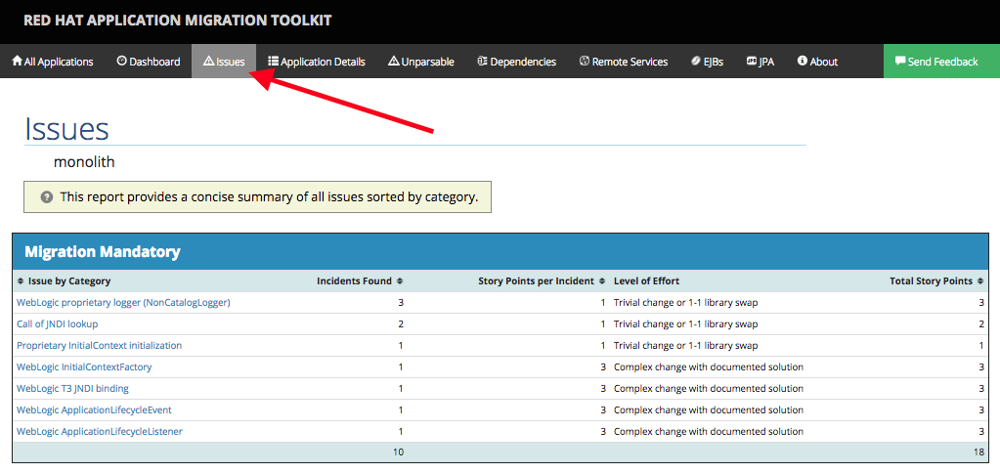

In this step we will migrate some Weblogic-specific code in the app to use standard Java EE interfaces.

Some of our application makes use of Weblogic-specific logging methods, which offer features related to logging of
internationalized content, and client-server logging.

In this case we are using Weblogic's `NonCatalogLogger` which is a simplified logging framework that doesn't use
localized message catalogs (hence the term _NonCatalog_).

The WebLogic `NonCatalogLogger` is not supported on JBoss EAP, and should be migrated to a supported logging framework, such as the JDK Logger or JBoss Logging.

**1. Select the issue related to `WebLogic proprietary logger (NonCatalogLogger)`**

[Open the report](https://[[HOST_SUBDOMAIN]]-9000-[[KATACODA_HOST]].environments.katacoda.com/) and then
click on the **Issues** tab again:



RHAMT provides helpful links to understand the issue deeper and offer guidance for the migration.

**2. Open the file**

Click here to open the offending file `src/main/java/com/redhat/coolstore/service/OrderServiceMDB.java`{{open}}

**3. Remove weblogic-specific `import` statements and inheritance**

The first step is to remove all instances of `import weblogic.x.y.z` at the top of the file. This ensures that our code will
not compile or run until we complete the migration. Remove the import statements for `import weblogic.i18n.logging.NonCatalogLogger;`.

Next, change the type of the `log` class variable to be java.util.Logger and to initialize it with the name of the class:

```java
private Logger log = Logger.getLogger(OrderServiceMDB.class.getName());
```

Don't forget to add the new import statement at the top of the file:

```java
import java.util.logging.Logger;
```

This makes our class use the standard Java Logging framework, a much more portable framework. The framework also
[supports internationalization](https://docs.oracle.com/javase/8/docs/technotes/guides/logging/overview.html#a1.17) if needed.

Finally, notice that the use of the `log` class variable does not need to change as the method signatures are identical.
For example, `log.info("Received order: " + orderStr);`. If your real world application used tons of Weblogic logging, at least
you save some time here!

The final class code should look like this (click **Copy To Editor** to automatically copy this to the editor and replace the entire code):

<pre class="file" data-filename="./src/main/java/com/redhat/coolstore/service/OrderServiceMDB.java" data-target="replace">
package com.redhat.coolstore.service;

import javax.ejb.ActivationConfigProperty;
import javax.ejb.MessageDriven;
import javax.inject.Inject;
import javax.jms.JMSException;
import javax.jms.Message;
import javax.jms.MessageListener;
import javax.jms.TextMessage;

import com.redhat.coolstore.model.Order;
import com.redhat.coolstore.utils.Transformers;

import java.util.logging.Logger;

@MessageDriven(name = "OrderServiceMDB", activationConfig = {
	@ActivationConfigProperty(propertyName = "destinationLookup", propertyValue = "topic/orders"),
	@ActivationConfigProperty(propertyName = "destinationType", propertyValue = "javax.jms.Topic"),
	@ActivationConfigProperty(propertyName = "acknowledgeMode", propertyValue = "Auto-acknowledge")})
public class OrderServiceMDB implements MessageListener {

	@Inject
	OrderService orderService;

	@Inject
	CatalogService catalogService;

	private Logger log = Logger.getLogger(OrderServiceMDB.class.getName());

	@Override
	public void onMessage(Message rcvMessage) {
		TextMessage msg = null;
		try {
				if (rcvMessage instanceof TextMessage) {
						msg = (TextMessage) rcvMessage;
						String orderStr = msg.getBody(String.class);
						log.info("Received order: " + orderStr);
						Order order = Transformers.jsonToOrder(orderStr);
						log.info("Order object is " + order);
						orderService.save(order);
						order.getItemList().forEach(orderItem -> {
							catalogService.updateInventoryItems(orderItem.getProductId(), orderItem.getQuantity());
						});
				}
		} catch (JMSException e) {
			throw new RuntimeException(e);
		}
	}

}
</pre>

When we run our newly-migrated application later you will be able to verify the logging works correctly by inspecting the log file output.

That one was pretty easy. Let's move on to the next issue!