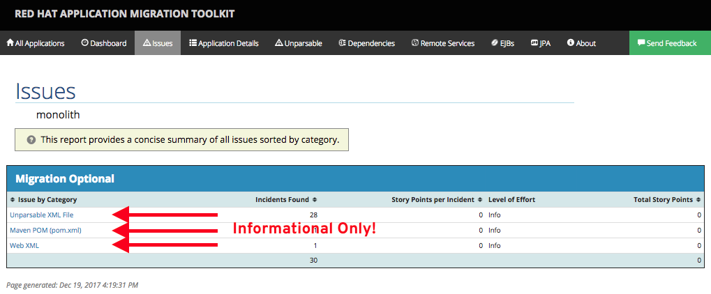

In this step we will re-run the RHAMT report to verify our migration was successfu.

**1. Run the RHAMT CLI against the project**

Click on the below command to re-execute the RHAMT CLI and analyze the new project:

```
~/rhamt-cli-4.0.0.Beta4/bin/rhamt-cli \
  --sourceMode \
  --input ~/monolith \
  --output ~/rhamt-report \
  --overwrite \
  --source weblogic \
  --target eap:7
```{{execute}}

**2. View the results**

The RHAMT CLI generates an updated HTML report.

To view the updated report, [reload the report web page](https://[[HOST_SUBDOMAIN]]-9000-[[KATACODA_HOST]].environments.katacoda.com/)

Click on the **Issues** tab and ensure that all of the Weblogic-specific issues are gone! You have successfully migrated
this app to JBoss EAP, congratulations!

[SCREENSHOT]

> You can ignore the remaining issues, as they are for informational purposes only.



## Migration Complete!

Now that we've migrated the app, let's deploy it and test it out and start to explore some of the features that JBoss EAP
plus Red Hat OpenShift bring to the table.

## Before moving on

Stop the report web server by clicking in **Terminal 2** and type CTRL-C to stop the server.