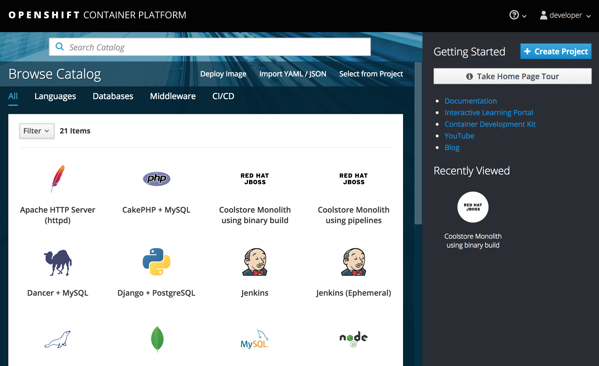

Now that we migrated the application you are probably eager to test it. To test it we locally we first need to install JBoss EAP.

**1. Add a OpenShift profile**

Open the `pom.xml`{{open}} file.

At the `<!-- TODO: Add OpenShift profile here -->` we are going to add a the following configuration to the pom.xml

<pre class="file" data-filename="pom.xml" data-target="insert" data-marker="<!-- TODO: Add OpenShift profile here -->">
          &lt;profile&gt;
              &lt;id&gt;openshift&lt;/id&gt;
              &lt;build&gt;
                  &lt;plugins&gt;
                      &lt;plugin&gt;
                          &lt;artifactId&gt;maven-war-plugin&lt;/artifactId&gt;
                          &lt;version&gt;2.6&lt;/version&gt;
                          &lt;configuration&gt;
                              &lt;webResources&gt;
                                  &lt;resource&gt;
                                      &lt;directory&gt;${basedir}/src/main/webapp/WEB-INF&lt;/directory&gt;
                                      &lt;filtering&gt;true&lt;/filtering&gt;		
                                      &lt;targetPath&gt;WEB-INF&lt;/targetPath&gt;
                                  &lt;/resource&gt;
                              &lt;/webResources&gt;
                              &lt;outputDirectory&gt;deployments&lt;/outputDirectory&gt;
                              &lt;warName&gt;ROOT&lt;/warName&gt;		
                          &lt;/configuration&gt;
                      &lt;/plugin&gt;
                  &lt;/plugins&gt;
              &lt;/build&gt;
          &lt;/profile&gt;
</pre>

**2. Create the OpenShift projcet**

First, click on the **OpenShift Console** tab next to the Terminal tab:

This will open a new browser with the openshift console.

Login using:

* Username `developer`
* Password: `developer`

You will see the OpenShift landing page:

Click **Create Project**, fill in the fields, and click **Create**:

* Name: `coolstore-dev`
* Display Name: `Coolstore Monolith - Dev`
* Description: _leave this field empty_

Click on the name of the newly-created project:

This will take you to the project overview. There's nothing there yet, but that's about to change.

**3. Deploy the monolith**

We'll use the CLI to deploy the components for our monolith. To deploy the monolith template using the CLI, execute the following commands:

Login to OpenShift:

``oc login [[HOST_SUBDOMAIN]]-8443-[[KATACODA_HOST]].environments.katacoda.com -u developer -p developer --insecure-skip-tls-verify=true``{{execute T1}}

Switch to the developer project you created earlier:

`oc project coolstore-dev`{{execute T1}}

And finally deploy template:

`oc new-app coolstore-monolith-binary-build`{{execute T1}}

This will deploy both a PostgreSQL database and JBoss EAP,
but it will not start a build for our application. You can see the components being deployed on the
Project Overview, but notice the **No deployments for Coolstore**. You have not yet deployed
the container image built in previous steps, but you'll do that next.

Then open up the web console and verify the monolith template items are created:

* [CoolStore Monolith Project](https://[[HOST_SUBDOMAIN]]-8443-[[KATACODA_HOST]].environments.katacoda.com/console/project/coolstore-dev/)

**4. Deploy application using Binary build**

In this development project we have selected to use a process called binary builds, which
means that instead of pointing to a public Git Repository and have the S2I build process
download, build, and then create a container image for us we are going to build locally
and just upload the artifact (e.g. the `.war` file). The binary deployment will speed up
the build process significantly.

First, build the project once more using the `openshift` Maven profile, which will create a
suitable binary for use with OpenShift (this is not a container image yet, but just the `.war`
file). We will do this with the `oc` command line.

Build the project:

``mvn clean package -Popenshift``{{execute T1}}

Now log the CLI into OpenShift (this is the same as what you did with the GUI):

``oc login [[HOST_SUBDOMAIN]]-8443-[[KATACODA_HOST]].environments.katacoda.com -u developer -p developer --insecure-skip-tls-verify=true``{{execute T1}}

And switch to the your newly created project:

``oc project coolstore-dev``{{execute T1}}

And finally, start the build process that will take the `.war` file and combine it with JBoss
EAP and produce a Linux container image which will be automatically deployed into the project,
thanks to the *DeploymentConfig* object created from the template:

``oc start-build coolstore --from-file=deployments/ROOT.war``{{execute T1}}

Check the OpenShift web console and you'll see the application being built:

Wait for the build and deploy to complete:

``oc rollout status -w dc/coolstore``{{execute T1}}

> If the above command reports `Error from server (ServerTimeout)` then simply re-run the command until it reports success!

When it's done you should see the application deployed successfully with blue circles for the
database and the monolith:

Test the application by clicking on the route link, which will open the same monolith Coolstore
in your browser, this time running on OpenShift:

## Congratulations!

Now you are using the same application that we built locally on OpenShift. That wasn't too hard right?

In the next step you'll explore more of the developer features of OpenShift in preparation for moving the
monolith to a microservices architecture later on. Let's go!

