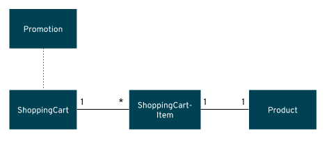

The sample project shows the components of a basic Vert.x project laid out in different
subdirectories according to Maven best practices.

**1. Examine the Maven project structure.**

> Click on the `tree` command below to automatically copy it into the terminal and execute it

``tree``{{execute}}

```sh
.
├── pom.xml
└── src
    ├── main
    │   ├── fabric8
    │   ├── java
    │   │   └── com
    │   │       └── redhat
    │   │           └── coolstore
    │   │               ├── model
    │   │               │   ├── Product.java
    │   │               │   ├── Promotion.java
    │   │               │   ├── ShoppingCart.java
    │   │               │   ├── ShoppingCartItem.java
    │   │               │   └── impl
    │   │               │       ├── FreeShippingPromotion.java
    │   │               │       ├── ProductCombinationPromotion.java
    │   │               │       ├── ProductImpl.java
    │   │               │       ├── ShoppingCartImpl.java
    │   │               │       ├── ShoppingCartItemImpl.java
    │   │               │       └── SingleProductPromotion.java
    │   │               └── utils
    │   │                   ├── Generator.java
    │   │                   └── Transformers.java
    │   └── resources
    │       └── webroot
    │           └── index.html
    └── test
        └── java
            └── com
                └── redhat
                    └── coolstore
                        └── utils
```

>**NOTE:** To generate similar project skeleton you can visit the [Vert.x Starter](http://start.vertx.io/) webpage.

If you have used Maven and Java before this should look familiar. This is how a typical Vert.x Java project would looks like. To save time we have provided the domain model, util classes for transforming and generating item, a index.html, and openshift configuration. 

The domain model consists of a ShoppingCart which has many ShoppingCartItems which has a one-to-one dependency to Product. The domain also consists of Different Promotions that uses the ShoppingCart state to see if it matches the criteria of the promotion.



## OpenShift Login

Before moving on, make sure you can login to OpenShift using this command:

`oc login [[HOST_SUBDOMAIN]]-8443-[[KATACODA_HOST]].environments.katacoda.com -u developer -p developer --insecure-skip-tls-verify=true`{{execute T1}}
