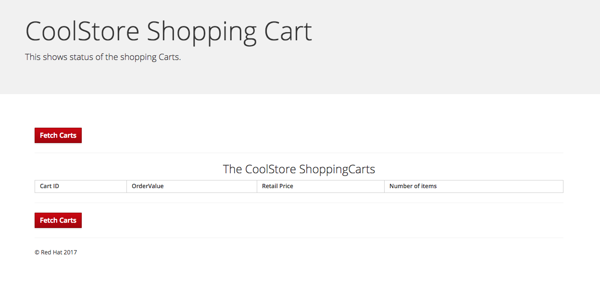

# Reactive programing 
In the previous step you did a bit of reactive programming, but Vert.x also support using RxJava. RxJava is a Java VM implementation of [ReactiveX (Reactive Extensions)](http://reactivex.io/) a library for composing asynchronous and event-based programs by using observable sequences.

With the introduction of Lambda in Java8 there we don't have to use RxJava for programming in Vert.x, but depending on your preference and experience you might want to use RxJava instead. Everything we do in this lab is possible to also implement using RxJava. However for simplicity and since RxJava is harder to understand for someone that never used it before we will stick with Java8 and Lambda in this lab.

# 1. Configuration and Vert.x
Vert.x has a very powerful configuration library called [Vert.x Config](http://vertx.io/docs/vertx-config/java/). The Config library can read configuration as Properties, Json, YaML, etc and it support a number stores like files, directories, http, git (extension), redis (extension), system properties, environment properties. 

The Config library is structured around:

* a **Config Retriever** instantiated and used by the Vert.x application. It configures a set of configuration store

* **Configuration store** defines a location from where the configuration data is read and and a syntax (json by default)

The configuration is retrieved as a JSON Object.

Default you can access the configuration in verticle by calling config().get..., it does however not support environment specific configuration like for ex SpringBoot. If you recall from the previous lab we used different configuration files for local vs OpenShift. If we like the same behavior in Vert.x we need to implement our selfs.

One thing that can seem a bit strange is that the **Config Retriever** reads the configuration async. So if we want to change the default behaviour we need to take that into consideration. 

Consider the following example.

```java
private void setupConfiguration(Vertx vertx) {
    ConfigStoreOptions defaultFileStore = new ConfigStoreOptions()
        .setType("file")
        .setConfig(new JsonObject().put("path", "config-default.json"));
    ConfigRetrieverOptions options = new ConfigRetrieverOptions();
    options.addStore(defaultFileStore);
    String profilesStr = System.getProperty("vertx.profiles.active");
    if(profilesStr!=null && profilesStr.length()>0) {
        Arrays.stream(profilesStr.split(",")).forEach(s -> options.addStore(new ConfigStoreOptions()
        .setType("file")
        .setConfig(new JsonObject().put("path", "config-" + s + ".json"))));
    }
    ConfigRetriever retriever = ConfigRetriever.create(vertx, options);

    retriever.getConfig((AsyncResult<JsonObject> ar) -> {
        if (ar.succeeded()) {
            JsonObject result = ar.result();
            result.fieldNames().forEach(s -> config().put(s, result.getValue(s)));
    });
}
```

Then in our start method of our Verticle we could run

```java
public void start() {
    setupConfiguration(vertx);
    Integer serverPort = config().getInteger("http.port", 10080);
    Router router = Router.router(vertx);
    router.get("/*").handler(StaticHandler.create());
    vertx.createHttpServer().requestHandler(router::accept).listen(serverPort);
}
```

At a first glance this may look like a good way to implement an environment specific configuration. Basically it will use a default config call `config-default.json` and if we start he application with parameter -Dvertx.profiles.active=[name] it will overload the default config with values from `config-[name].json`.

**THIS WILL NOT WORK!**

The reason that it doesn't work is that when we calling setupConfiguration() the `ConfigStore` etc will execute sync, but the actual retrieval of the configuration values is asynchronous and while the program is waiting for async operations like opening a file and read it the `start()` method will continue to run and when it gets to `Integer serverPort = config().getInteger("http.port", 8889);` the value has not been populated yet. E.g. the config "http.port" will fail and the default value of 8889 will always be used. 

**1. Load configuration and other Verticles**

One solution to this problem is to load our Verticle from another verticle and pass the configuration as a depoyment option. 

Let's add a MainVerticle that will load the CartServiceVerticle like this:

<pre class="file" data-filename="src/main/java/com/redhat/coolstore/MainVerticle.java" data-target="replace">
package com.redhat.coolstore;

import io.vertx.config.ConfigRetriever;
import io.vertx.config.ConfigRetrieverOptions;
import io.vertx.config.ConfigStoreOptions;
import io.vertx.core.*;
import io.vertx.core.json.JsonObject;

import java.util.Arrays;
import java.util.concurrent.ArrayBlockingQueue;
import java.util.concurrent.BlockingQueue;

public class MainVerticle extends AbstractVerticle {

    @Override
    public void start() {
        ConfigRetriever.getConfigAsFuture(getRetriever())
            .setHandler(config -&gt;  {
                vertx.deployVerticle(
                    CartServiceVerticle.class.getName(),
                    new DeploymentOptions().setConfig(config.result())
                );
                // TODO: Deploy PromoServiceVerticle
                // TODO: Deploy ShippingServiceVerticle
            });
    }

    private ConfigRetriever getRetriever() {
        ConfigStoreOptions defaultFileStore = new ConfigStoreOptions()
            .setType("file")
            .setConfig(new JsonObject().put("path", "config-default.json"));
        ConfigRetrieverOptions configStoreOptions = new ConfigRetrieverOptions();
        configStoreOptions.addStore(defaultFileStore);
        String profilesStr = System.getProperty("vertx.profiles.active");
        if(profilesStr!=null && profilesStr.length()&gt;0) {
            Arrays.stream(profilesStr.split(",")).forEach(s -&gt; configStoreOptions.addStore(new ConfigStoreOptions()
                .setType("file")
                .setConfig(new JsonObject().put("path", "config-" + s + ".json"))));
        }
        return ConfigRetriever.create(vertx, configStoreOptions);
    }
}
</pre>

>**NOTE:** The MainVerticle deploys the `CartServiceVerticle` in a handler that will be called after the retriever has read the configuration. It then passes the new configuration as `DeploymentOptions` to the CartService. Later on we will use this to deploy other Verticles.

**3. Create the configuration file**
At the moment we only need one value in the configuration file, but we will add more later.

Copy this into the configuration file (or click the button):

<pre class="file" data-filename="src/main/resources/config-default.json" data-target="replace">
{
    "http.port" : 8082
}
</pre>

Finally we need to tell the `vertx-maven-plugin` to use the MainVerticle instead of the CartServiceVerticle. In the ```pom.xml```{{open}} under `project->properties` there is a tag called `<vertx.verticle>` that currently specifies the full path to the `CartServiceVerticle`.

First open the ```pom.xml```{{open}}

Then Change the `<vertx.verticle>com.redhat.coolstore.MainVerticle</vertx.verticle>` to `<vertx.verticle>com.redhat.coolstore.CartServiceVerticle</vertx.verticle>`

<pre class="file" data-filename="pom.xml" data-target="insert" data-marker="com.redhat.coolstore.CartServiceVerticle">
com.redhat.coolstore.MainVerticle
</pre>


**4. Test the default configuration**

Restart the application by running the following in the terminal or in clicking the execute button.

``mvn compile vertx:run``{{execute T1 interrupt}}

In the output you should now see that the server is starting on port 8082 and not 10080 like before

Click on the **Local Web Browser** tab in the console frame of this browser window, which will open another tab or window of your browser pointing to port 8082 on your client. 


Or use [this](https://[[HOST_SUBDOMAIN]]-8082-[[KATACODA_HOST]].environments.katacoda.com/) link.

Again you should now see an HTML page that looks like this:




## Congratulations

You have now successfully implemented environment specific configuration. Please note that future version of Eclipse Vert.x will probably include a better way to solve this, but this should have helped you understand a bit of how programming in a reactive world is different then for example Java EE or Spring (Spring 5 now includes some reactive extensions as well).

In next step of this scenario, we will start implementing our rest endpoints.


