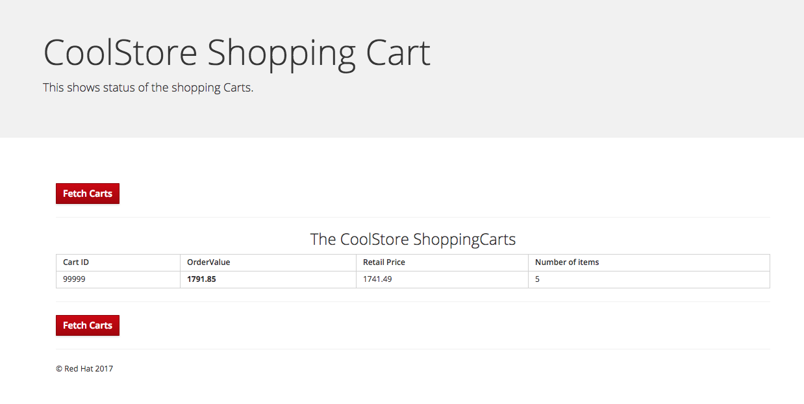

So now that you have learned how to create a rest service and also how to implement environmental specific configuration let's start building our rest endpoints.

**1. Creating a GET /services/cart endpoint**
First we are going to create a very simple endpoint that returns a `ShopppingCart` object as a JSON String using the ```./src/main/java/com/redhat/coolstore/utils/Transformers.java```{open} to get a `JsonObject` that we can then return as String

<pre class="file" data-filename="./src/main/java/com/redhat/coolstore/CartServiceVerticle.java" data-target="insert" data-marker="//TODO: Add handler for getting a shoppingCart by id">
    private void getCart(RoutingContext rc) {
        logger.info("Retrieved " + rc.request().method().name() + " request to " + rc.request().absoluteURI());
        String cartId = rc.pathParam("cartId");
        ShoppingCart cart = getCart(cartId);
        sendCart(cart,rc);
    }
</pre>


**2. Creating a GET /services/carts endpoint that returns all carts**

Now let's create a bit more complex implementation that returns many `ShoppingCarts` as a JSON array.

<pre class="file" data-filename="./src/main/java/com/redhat/coolstore/CartServiceVerticle.java" data-target="insert" data-marker="//TODO: Add handler for getting a list of shoppingCarts">
    private void getCarts(RoutingContext rc) {
        logger.info("Retrieved " + rc.request().method().name() + " request to " + rc.request().absoluteURI());
        JsonArray cartList = new JsonArray();
        carts.keySet().forEach(cartId -&gt; cartList.add(Transformers.shoppingCartToJson(carts.get(cartId))));
        rc.response()
            .setStatusCode(200)
            .putHeader(HttpHeaders.CONTENT_TYPE, "application/json")
            .end(cartList.encodePrettily());
    }
</pre>

The most important line in this method is this:
```java
carts.keySet().forEach(cartId -&gt; cartList.add(Transformers.shoppingCartToJson(carts.get(cartId))));
``` 

In this lambda expression we are iterating through the list of shopping carts and transforming them to JsonObject using the ```./src/main/java/com/redhat/coolstore/utils/Transformers.java```{open} to get a `JsonObject` that we add to a `JsonArray`. We can then return a String encoding of that JsonArray to the response.

**3. Add a routes**

Add the first route by adding the following at `//TODO: Create cart router` marker (or click the button)
<pre class="file" data-filename="./src/main/java/com/redhat/coolstore/CartServiceVerticle.java" data-target="insert" data-marker="//TODO: Create cart router">
router.get("/services/carts").handler(this::getCart);
</pre>

Add the second route by adding the following at //TODO: Create carts router marker (or click the button)
<pre class="file" data-filename="./src/main/java/com/redhat/coolstore/CartServiceVerticle.java" data-target="insert" data-marker="//TODO: Create carts router">
router.get("/services/carts").handler(this::getCarts);
</pre>

The `this::getCarts` is a lambda reference to the `getCarts(RoutingContext)`. Another way to write this would be like this

```java
router.get("/services/carts").handler(rc -> {
  this.getCarts(rc);
});
```

**4. Test the new Route**

Restart the application by running the following in the terminal or in clicking the execute button.

``mvn compile vertx:run``{{execute interrupt}}

Now test the route with a curl command int the terminal like this:
```curl -X GET https://[[HOST_SUBDOMAIN]]-10080-[[KATACODA_HOST]].environments.katacoda.com/services/carts```{{execute T2}

This should print the body of the response  that looks somewhat like this. Note that the the content from this is generate from the ```./src/main/java/com/redhat/coolstore/utils/Transformers.java```{open} and will return a random number of products, so you actual content may vary.


```json
[ {
  "cartId" : "99999",
  "orderValue" : 1791.85,
  "retailPrice" : 1741.49,
  "discount" : 0.0,
  "shippingFee" : 61.4,
  "shippingDiscount" : 11.04,
  "items" : [ {
    "product" : {
      "itemId" : "329299",
      "price" : 166.89,
      "name" : "Red Fedora",
      "desc" : null,
      "location" : null,
      "link" : null
    },
    "quantity" : 2
  }, {
    "product" : {
      "itemId" : "329199",
      "price" : 187.8,
      "name" : "Forge Laptop Sticker",
      "desc" : null,
      "location" : null,
      "link" : null
    },
    "quantity" : 4
  }, {
    "product" : {
      "itemId" : "165613",
      "price" : 148.02,
      "name" : "Solid Performance Polo",
      "desc" : null,
      "location" : null,
      "link" : null
    },
    "quantity" : 2
  }, {
    "product" : {
      "itemId" : "165614",
      "price" : 144.83,
      "name" : "Ogio Caliber Polo",
      "desc" : null,
      "location" : null,
      "link" : null
    },
    "quantity" : 1
  }, {
    "product" : {
      "itemId" : "165954",
      "price" : 107.82,
      "name" : "16 oz. Vortex Tumbler",
      "desc" : null,
      "location" : null,
      "link" : null
    },
    "quantity" : 2
  } ]
} ]
```

Click on the **Local Web Browser** tab in the console frame of this browser window, which will open another tab or window of your browser pointing to port 8083 on your client. 


Or use [this](https://[[HOST_SUBDOMAIN]]-8083-[[KATACODA_HOST]].environments.katacoda.com/) link.

Now the default page should have an entry in the table matching the values for your JSON file above.



## Congratulations

You have now successfully implemented the first out of many endpoints that we need to strangle the monolith. You have also learned that `<object>::<method>` is a convenient way to reference a lambda expression. 

In the next step we will implement another endpoint and this time it will also call out to an external service using rest.