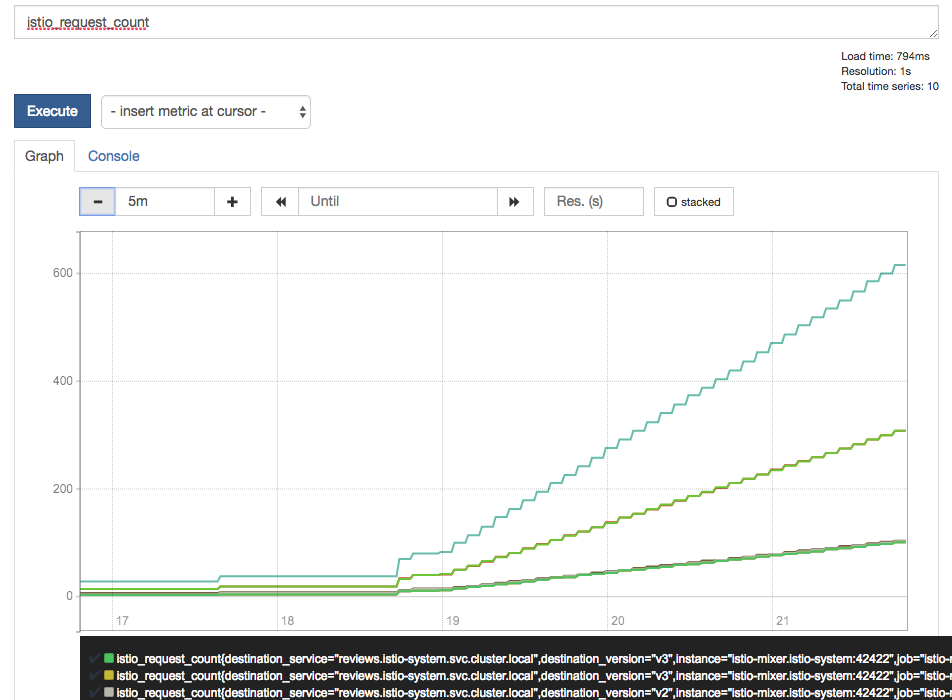
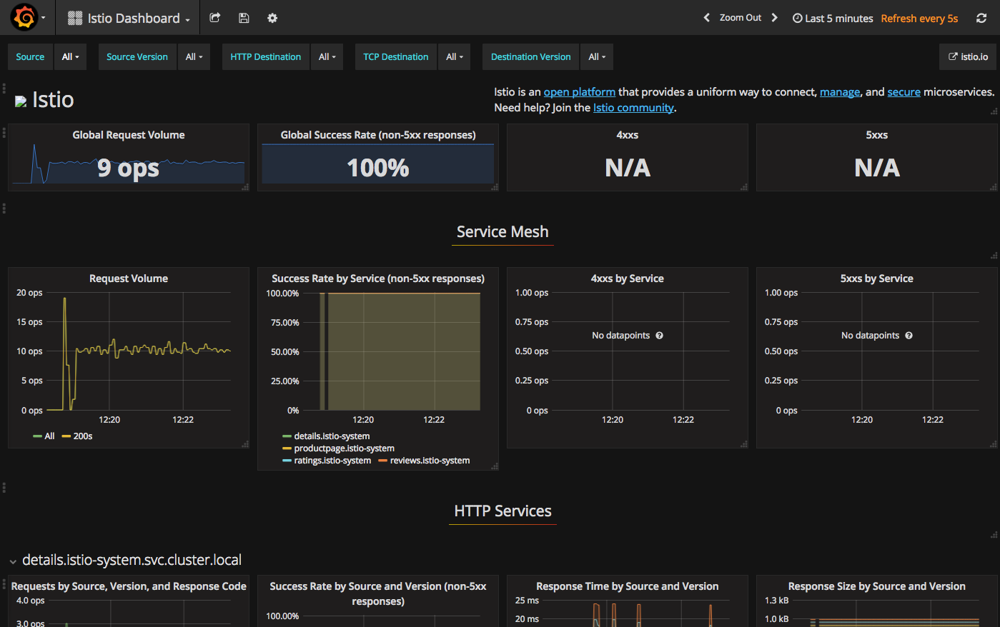

## Visualize the network

The Servicegraph service is an example service that provides endpoints for generating and visualizing a graph of services within a mesh. It exposes the following endpoints:

* `/graph` which provides a JSON serialization of the servicegraph
* `/dotgraph` which provides a dot serialization of the servicegraph
* `/dotviz` which provides a visual representation of the servicegraph

## Examine Service Graph

The Service Graph addon provides a visualization of the different services and how they are connected. Open the link:

* [Bookinfo Service Graph (Dotviz)](http://servicegraph-istio-system.[[HOST_SUBDOMAIN]]-80-[[KATACODA_HOST]].environments.katacoda.com/dotviz)

It should look like:

As you add and remove services over time in your projects, you can use this to verify the connections between services and provides
a high-level telemetry showing the rate at which services are accessed.

## Generating application load

To get a better idea of the power of metrics, let's setup an endless loop that will continually access
the application and generate load. We'll open up a separate terminal just for this purpose. Execute this command:

`while true; do
    curl -o /dev/null -s -w "%{http_code}\n" \
      http://istio-ingress-istio-system.[[HOST_SUBDOMAIN]]-80-[[KATACODA_HOST]].environments.katacoda.com/productpage
  sleep .2
done`{{execute T2}}

This command will endlessly access the application and report the HTTP status result in a separate terminal window.

With this application load running, metrics will become much more interesting in the next few steps.

## Querying Metrics with Prometheus

[Prometheus](https://prometheus.io/) exposes an endpoint serving generated metric values. The Prometheus
add-on is a Prometheus server that comes pre-configured to scrape Mixer endpoints
to collect the exposed metrics. It provides a mechanism for persistent storage
and querying of Istio metrics.

Open the Prometheus UI:

* [Prometheus UI](http://prometheus-istio-system.[[HOST_SUBDOMAIN]]-80-[[KATACODA_HOST]].environments.katacoda.com)

In the “Expression” input box at the top of the web page, enter the text: `istio_request_count`.
Then, click the Execute button.

You should see a listing of each of the application's services along with a count of how many times it was accessed.

You can also graph the results over time by clicking on the _Graph_ tab:

Other expressions to try:

* Total count of all requests to `productpage` service: `istio_request_count{destination_service=~"productpage.*"}`
* Total count of all requests to `v3` of the `reviews` service: `istio_request_count{destination_service=~"reviews.*", destination_version="v3"}`
* Rate of requests over the past 5 minutes to all `productpage` services: `rate(istio_request_count{destination_service=~"productpage.*", response_code="200"}[5m])`

There are many, many different queries you can perform to extract the data you need. Consult the
[Prometheus documentation](https://prometheus.io/docs) for more detail.

## Visualizing Metrics with Grafana

As the number of services and interactions grows in your application, this style of metrics may be a bit
overwhelming. [Grafana](https://grafana.com/) provides a visual representation of many available Prometheus
metrics extracted from the Istio data plane and can be used to quickly spot problems and take action.

Open the Grafana Dashboard:

* [Grafana Dashboard](http://grafana-istio-system.[[HOST_SUBDOMAIN]]-80-[[KATACODA_HOST]].environments.katacoda.com/dashboard/db/istio-dashboard)

The Grafana Dashboard for Istio consists of three main sections:

1. **A Global Summary View.** This section provides high-level summary of HTTP requests flowing through the service mesh.
1. **A Mesh Summary View.** This section provides slightly more detail than the Global Summary View, allowing per-service filtering and selection.
1. **Individual Services View.** This section provides metrics about requests and responses for each individual service within the mesh (HTTP and TCP).

For more on how to create, configure, and edit dashboards, please see the [Grafana documentation](http://docs.grafana.org/).

As a developer, you can get quite a bit of information from these metrics without doing anything to the application
itself. Let's use our new tools in the next section to see the real power of Istio to diagnose and fix issues in
applications and make them more resilient and robust.

