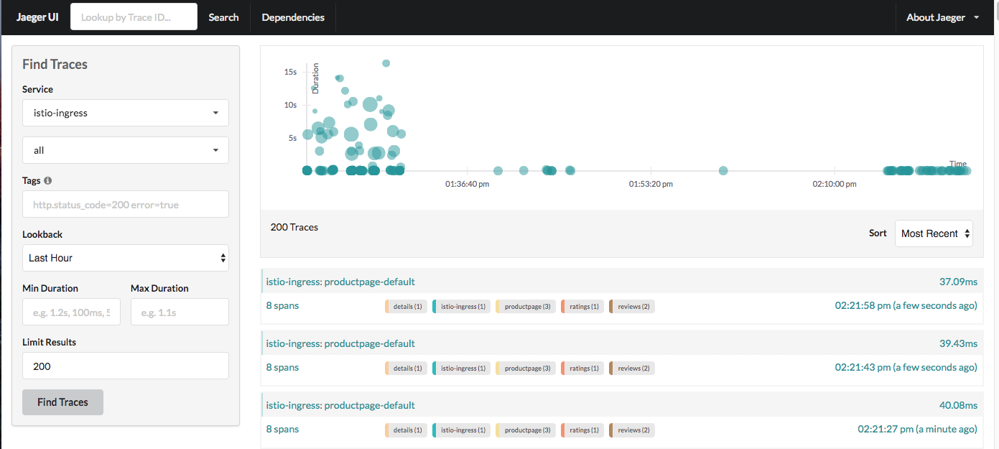
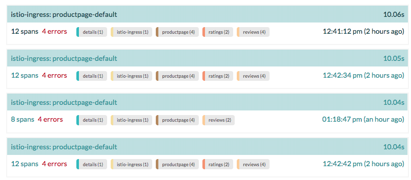
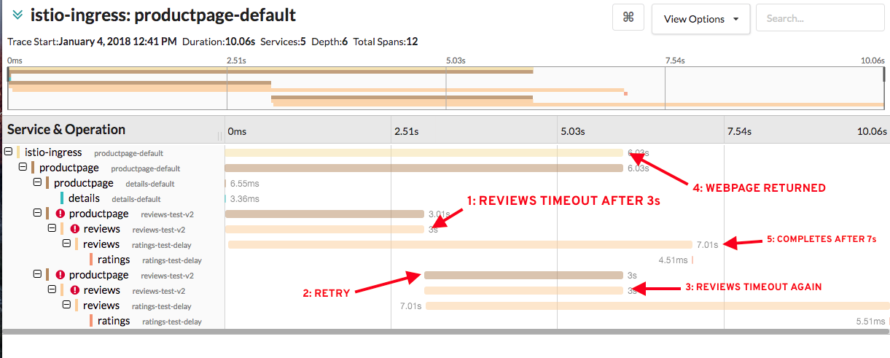

This step shows you how Istio-enabled applications automatically collect
_trace spans_ telemetry and can visualize it with tools like using Jaeger or Zipkin.
After completing this task, you should
understand all of the assumptions about your application and how to have it
participate in tracing, regardless of what language/framework/platform you
use to build your application.

## Tracing Goals
Developers and engineering organizations are trading in old, monolithic systems
for modern microservice architectures, and they do so for numerous compelling
reasons: system components scale independently, dev teams stay small and agile,
deployments are continuous and decoupled, and so on.

Once a production system contends with real concurrency or splits into many
services, crucial (and formerly easy) tasks become difficult: user-facing
latency optimization, root-cause analysis of backend errors, communication
about distinct pieces of a now-distributed system, etc.

#### What is a trace?
At the highest level, a trace tells the story of a transaction or workflow as
it propagates through a (potentially distributed) system. A trace is a directed
acyclic graph (DAG) of _spans_: named, timed operations representing a
contiguous segment of work in that trace.

Each component (microservice) in a distributed trace will contribute its
own span or spans. For example:

This type of visualization adds the context of time, the hierarchy of
the services involved, and the serial or parallel nature of the process/task
execution. This view helps to highlight the system's critical path. By focusing
on the critical path, attention can focus on the area of code where the most
valuable improvements can be made. For example, you might want to trace the
resource allocation spans inside an API request down to the underlying blocking calls.

## Access Jaeger Console
With our application up and our script running to generate loads, visit the Jaeger Console:

* [Jaeger Query Dashboard](http://jaeger-query-istio-system.[[HOST_SUBDOMAIN]]-80-[[KATACODA_HOST]].environments.katacoda.com)

Select `istio-ingress` from the _Service_ dropdown menu, change the value of **Limit Results** to `200` and click **Find Traces**:

In the top right corner, a duration vs. time scatter plot gives a visual representation of the results, showing how and when
each service was accessed, with drill-down capability. The bottom right includes a list of all spans that were traced over the last
hour (limited to 200).

If you click on the first trace in the listing, you should see the details corresponding
to a recent access to `/productpage`. The page should look something like this:

As you can see, the trace is comprised of _spans_, where each span corresponds to a
microservice invoked during the execution of a `/productpage` request.

The first line represents the external call to the entry point of our application controlled by
 `istio-ingress`. It in thrn calls the `productpage` service. Each line below
represents the internal calls to the other services to construct the result, including the
time it took for each service to respond.

To demonstrate the value of tracing, let's re-visit our earlier timeout bug! If you recall, we had
injected a 7 second delay in the `ratings` microservice for our user _jason_. So when we loaded the
web page it should have taken 7 seconds before showing the star ratings.

In reality, the webpage loaded in 6 seconds and we saw no rating stars! Why did this happen? We know
from earlier that it was because the timeout from `reviews`->`ratings` was much shorter than the `ratings`
timeout itself, so it prematurely failed the access to `ratings` after 2 retries (of 3 seconds each), resulting
in a failed webpage after 6 seconds. But can we see this in the tracing? Yes, we can!

To see this bug, open the Jaeger tracing console:

* [Jaeger Query Dashboard](http://jaeger-query-istio-system.[[HOST_SUBDOMAIN]]-80-[[KATACODA_HOST]].environments.katacoda.com)

Since users of our application were reporting lengthy waits of 5 seconds or more, let's look for traces
that took at least 5 seconds. Select these options for the query:

* **Service**: `istio-ingress`
* **Min Duration**: `5s`

Then click **Find Traces**. Change the sorting to **Longest First** to see the ones that took the longest.
The result list should show several spans with errors:

Click on the top-most span that took ~10s and open details for it:

Here you can see the `reviews` service takes 2 attempts to access the `ratings` service, with each attempt
timing out after 3 seconds. After the second attempt, it gives up and returns a failure back to the product
page. Meanwhile, each of the attempts to get ratings finally succeeds after its fault-injected 7 second delay,
but it's too late as the reviews service has already given up by that point.

The timeouts are incompatible, and need to be adjusted. This is left as an exercise to the reader.

Istio’s fault injection rules and tracing capabilities help you identify such anomalies without impacting end users.

## Before moving on

Let's stop the load generator running against our app. Navigate to **Terminal 2** and type
`CTRL-C` to stop the generator or click `clear`{{execute T2 interrupt}}.

## Congratulations!

Distributed tracing speeds up troubleshooting by allowing developers to quickly understand
how different services contribute to the overall end-user perceived latency. In addition,
it can be a valuable tool to diagnose and troubleshoot distributed applications.

